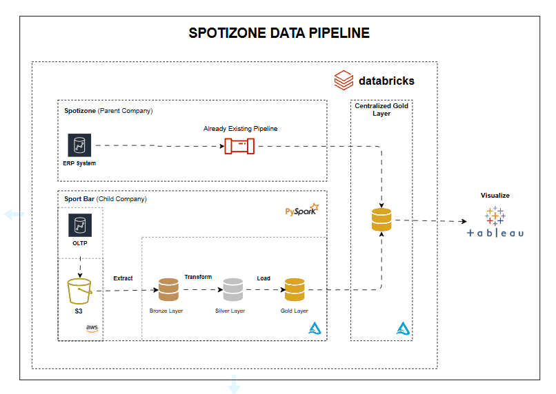
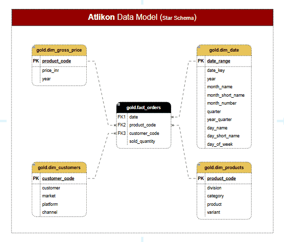
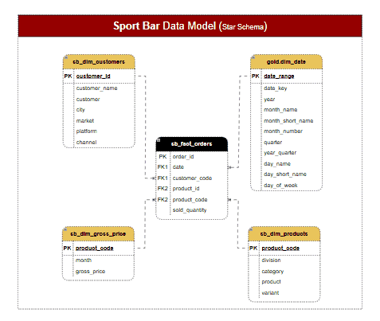
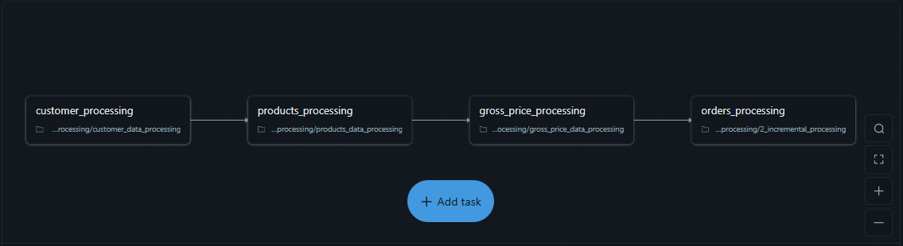
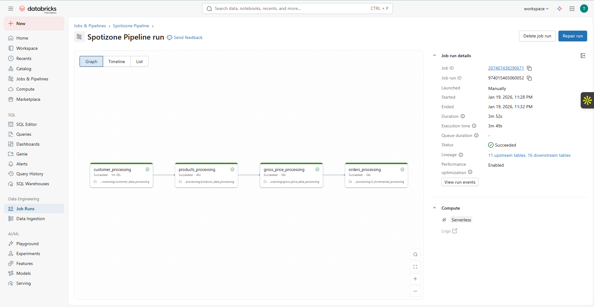
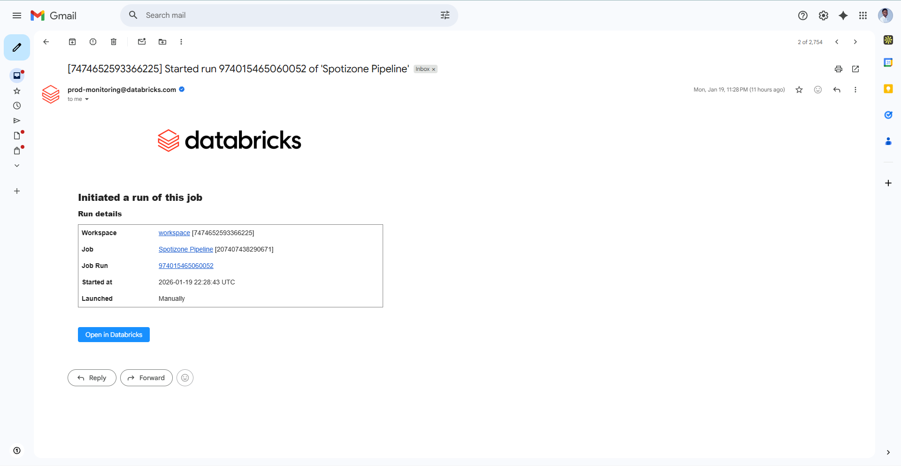

# Chaos to Clarity: Spotizone Data Pipeline in Databricks
## _Overview_

## _Table of Content_
 - 📃 [Overview](#overview)
 - 📖 [Background Story](#background-story)
 - ✏️ [Project Tasks & Objective](#project-task--Objective)
 - 🏗️ [System Architecture](#system-architecture)
 - 🔗 [Data Model](#data-model)
 - 🛠️ [Tech Stack](#tech-stack)
 - 🔃 [How the Pipeline Works](#how-the-pipeline-works)
 - 📈 [Dashboard](#dashboard)
 - 🙋🏽‍♂️ [Contact](#contact)

## _Background Story_

**Spotizone**, a global sports equipment manufacturer, acquired **Sport Bar**, a fast-growing startup in the energy bar and athletic nutrition space. The acquisition brought innovation and new customer opportunities, but it also introduced conflicting data across both organizations, with inconsistent formats and missing records.

The impact was immediate - Teams spent hours reconciling data instead of acting on it, sales numbers didn’t align, and leadership struggled to make confident decisions. Without a single source of truth, what should have been a smooth integration became a constant cycle of patching gaps and chasing inconsistencies.

## _Project Tasks & Objective_
The objective of this project is to transform Sport Bar inconsistent data into a scalable and trustworthy foundation for decision-making. This Includes:
 - Cleaning, standardizing, and validating records to ensure consistency.
 - Merging Sport Bar data into Sportizone's pipeline to support accurate, unified reporting.
 - Orchestrating automated daily pipeline runs to ensure reliable, repeatable data processing.

## _System Architecture_

### _Data Pipeline Flow_
This architecture follows the medallion architecture and illustrates an end-to-end data pipeline designed to integrate Sport Bar data into Spotizone's existing data pipeline for unified reporting. The pipeline ensures structured ingestion, transformation, and consolidation of data to create a single source of truth for reliable decision-making.
#### Key Components
 - #### 🔃 Extraction / Ingestion - From Source
  Data from Sport Bar's OLTP systems is first landed in AWS S3, which serves as the staging and landing zone for raw extracts. From S3, the data is ingested into the Databricks Lakehouse in batch and incrementally, ensuring raw records are preserved for downstream processing.

 - #### 🔦 Transformation - Databricks (Medallion Architecture)
    - Bronze Layer: Raw ingestion of Sport Bar data with **zero** transformation
    - Silver Layer: Schema standardization, data cleasing and validation
    - Gold Layer: Business-ready, unified datasets 
      - This business-ready data is then merged with existing Spotizone data for unified reporting
 
 - #### 🏠 Storage - Delta Lake 
  The merged gold-layer data is stored as delta tables for ACID transaction and scalable analytics

 - #### 📈 Visualization - Tableau
  Tableau feeds directly into the gold layer, enabling dynamic dashboards and reports for stakeholders.

## _Data Modelling_
#### Gold Layer - Spotizone (Final Output)

#### Gold Layer - Sport Bar

## _Tech Stack_
 - Databricks
 - Apache Spark (PySpark)
 - SQL
 - Tableau
 - Git / GitHub

## _How the Pipeline Works_
#### Databricks Jobs
  The Databricks Jobs orchestrates the daily execution of the Databricks notebooks. A pipeline called `spotizone pipeline` is created that automatically orchestrates the notebooks. Below is the structure of the pipeline:

#### 🧑🏽‍💼 customer_processing 
  The [Customer Processing Notebook](Scripts/2_spotizone_dim_processing/customer_data_processing) processes Sport Bar customer data across the Bronze, Silver, and Gold layers and integrates it into Spotizone’s existing `dim_customer` existing table.

 - **Execution Strategy**
   - The notebook is designed as a full refresh pipeline for Sport Bar data where by on each run, data in the `Bronze`, `Silver`, and `Gold` layers is fully overwritten

 - **Bronze Layer (Raw Data)**
   - Ingests Sport Bar customer data from AWS S3 into Databricks Unity Catalog
   - Loads raw data using batch processing with **zero** transformation

 - **Silver Layer (Transformation)**
   - Cleans and standardizes customer records
   - Removes duplicate entries
   - Corrects inconsistent customer city names
   - Ensures mandatory attributes (e.g. city) contain no null values

 - **Gold Layer (Business-Ready & Merging)**
   - Prepares standardized, analytics-ready customer data
   - Merges Gold-layer customer data into Spotizone’s dim_customer table using incremental logic:
     - Updates existing records when customer_code matches
     - Inserts new records when no match is found
     - Produces a unified customer dimension table used for reporting

#### ⛳ products_processing
The [Products Processing Notebook](Scripts/2_spotizone_dim_processing/products_data_processing) processes Sport Bar products data across the Bronze, Silver, and Gold layers and integrates it into Spotizone’s existing `dim_products` existing table.
 - **Execution Strategy**
   - The `product_processing` notebook is designed as a full refresh pipeline for Sport Bar data where by on each run, data in the `Bronze`, `Silver`, and `Gold` layers is fully overwritten
 - **Bronze Layer (Raw Data)**
   - Ingests Sport Bar products records from AWS S3 into Databricks Unity Catalog
   - Loads raw data using batch processing with **zero** transformation

 - **Silver Layer (Transformation)**
   - Cleans and transforms products data
   - Removes duplicate entries, solve `product_id` inconsistencies and create new columns (e.g `variant` & `division` )

 - **Gold Layer (Business-Ready & Merging)**
   - Prepares transformed, analytics-ready `products` data
   - Merges Gold-layer products data into Spotizone’s `dim_products` table using incremental logic:
     - Updates existing records when matches found
     - Inserts new records when no match is found
     - Produces a unified products dimension table used for reporting

#### 💰 gross_price_processing
The [Gross Price Processing Notebook](Scripts/2_spotizone_dim_processing/gross_price_data_processing) processes Sport Bar `gross_price` data across the Bronze, Silver, and Gold layers and integrates it into Spotizone's existing `dim_gross_price` existing table.
 - **Execution Strategy**
   - The `gross_price_processing` notebook is designed as a full refresh pipeline for Sport Bar data where by on each run, data in the `Bronze`, `Silver`, and `Gold` layers is fully overwritten
 - **Bronze Layer (Raw Data)**
   - Ingests Sport Bar gross_price records from AWS S3 into Databricks Unity Catalog
   - Loads raw data using batch processing with **zero** transformation

 - **Silver Layer (Transformation)**
   - Cleans and transforms inconsistent date formats in `month` column
   - Handles gross_price negative values (e.g -84 to 84)

 - **Gold Layer (Business-Ready & Merging)**
   - Prepares transformed, analytics-ready `gross_price` data
   - Merges Gold-layer gross_price data into Spotizone’s `dim_gross_price` table using incremental logic:
     - Updates existing records when matches found
     - Inserts new records when no match is found
     - Produces a unified products dimension table used for reporting

#### 🛒 orders_processing
The [Orders Processing Notebook](Scripts/2_spotizone_dim_processing/gross_price_data_processing) processes Sport Bar `fact_orders` data across the Bronze, Silver, and Gold layers and integrates it into Spotizone's existing `fact_orders` existing table.
 - **Execution Strategy**
   - The `orders_processing` notebook is designed to run using incremental append logic where by on each run, Only new data in the `Bronze`, `Silver`, and `Gold` layers is added
   - Staging layers are used to isolate raw and newly cleaned data
 - **Bronze Layer (Raw Data)**
   - Extracts incremental order data from AWS S3
   - Appends records to the existing Sport Bar `fact_orders` Bronze table to align with Spotizone data
   - Writes the same data to a Bronze staging table with **zero** transformation, preserving raw source data

 - **Silver Layer (Transformation)**
   - Reads incremental data from the `bronze staging layer`
   - Removes records with null `order_id`, standardizing `order_placement_date` formats
   - Enrich orders by joining `product_code` from the Silver product table
   - Appends the transformed data into the existing Silver orders table and writes newly cleaned incremental data into a Silver staging table

 - **Gold Layer (Business-Ready & Merging)**
   - Reads data from the Silver orders staging layer
   - Appends new records from staging silver layer into the existing Gold `fact_orders` table
   - Incrementally merge `sport bar fact_orders` into `spotizone fact_orders` table

#### Pipeline Manual Run
The pipeline `Spotizone Pipeline` is manually triggered for an initial test run to validate end-to-end execution before enabling scheduled runs

#### Pipeline Email Notification
Email notifications are configured as well to alert stakeholders when the pipeline starts, completes successfully, or fails.

#### Pipeline Trigger Run
A daily Trigger is created and time set to run the pipeline daily at exactly 11:00 pm / 23:00 at the end of business days

## _Dashboard_

## _Contact_