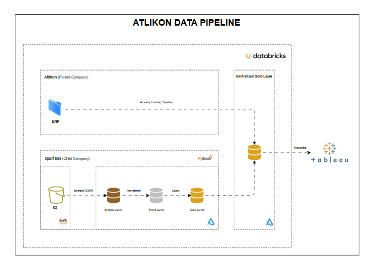

# From Chaos to Clarity: Atlikon Data Pipeline in Databricks

### **Background Story**
Every year, companies acquire other businesses with the goal of expanding into newer markets and creating greater value. **Atlikon**, a global sports equipment manufacturer, acquired **Sport Bar**, a fast-growing startup in the energy bar and athletic nutrition space. This acquisition brought innovation and new customer opportunities, but also introduced data conflicts across both businesses, with inconsistent formats and missing records.

The impact was immediate. Teams spent hours reconciling conflicting data instead of acting on it, sales numbers didn’t align, and leadership struggled to make confident decisions. Without a single source of truth, what should have been a smooth integration became a constant cycle of patching gaps and chasing inconsistencies.

### **Project Goal & Objectives**
Integrate Sport Bar’s data into Atlikon’s existing pipeline to create a unified, reliable source of truth for reporting. This includes:
 - Ingesting data from Sport Bar’s diverse sources, including spreadsheets and cloud tools
 - Transforming and validating records to ensure consistency across dataset
 - Merging Sport Bar data into Atlikon’s pipeline to support unified reporting and trustworthy decision making.

### 🧱 **Data Architecture**

